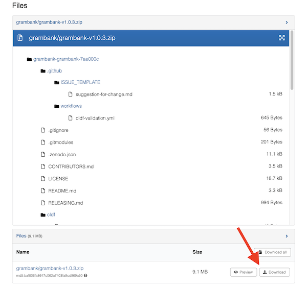

```{r, include = FALSE}
knitr::opts_chunk$set(
  collapse = TRUE,
  comment = "#>"
)
```

```{r setup}
library(rcldf)
library(dplyr)
library(ggplot2)
library(patchwork)

theme_set(theme_classic())
```

# Introduction

The `rcldf` package provides tools to read and interact with `CLDF`
datasets in R. This vignette demonstrates how to install the package,
load these datasets, and use them.

Cross-Linguistic Data Formats (CLDF, [Forkel et al.
2018](https://doi.org/10.1038/sdata.2018.205)) is a standardized data
format designed to handle cross-linguistic and cross-cultural datasets.
CLDF provides a consistent [specification and package
format](https://cldf.clld.org/) for common types of linguistic and
cultural data e.g. word lists, grammatical features, cultural traits
etc. The aim of the format is to enable provide a simple, reliable data
format to facilitate the sharing and re-use of these data to make new
analyses possible.

There are currently more than [250 CLDF datasets
available](https://zenodo.org/search?q=CLDF&f=resource_type%3Adataset&l=list&p=1&s=10&sort=bestmatch)
containing data from the world's languages and cultures including
everything from catalogues of linguistic metadata (e.g.
[Glottolog](https://glottolog.org)),
[EndangeredLanguages.com](https://www.endangeredlanguages.com)), to word
lists of lexical data (e.g. [Lexibank](https://lexibank.clld.org/)),
grammatical features (e.g. [WALS](https://wals.info) and
[Grambank](https://grambank.clld.info)), phonetic information (e.g.
[Phoible](https://phoible.org/)), geographic informations (e.g. [Wurm &
Hattori 1981/1983](https://doi.org/10.5281/zenodo.15183865)), and
religious and cultural databases (e.g. [D-PLACE](https://d-place.org/)
and [Pulotu](https://pulotu.com)).

# Installation

You can install `rcldf` directly from GitHub using the `devtools`
package:

```{r eval = FALSE}
library(devtools)
install_github("SimonGreenhill/rcldf", dependencies = TRUE)
library(rcldf)
```

# Loading a CLDF Dataset

Once installed, load a CLDF dataset by creating a `cldf` object from a
dataset. You can point to the dataset using a path or URL where the
dataset is located:

```{r eval = FALSE}
library(rcldf)

# Load from a local directory:
ds <- cldf('/path/to/dir/wals_1a_cldf')

# or load from a specific metadatafile:
ds <- cldf('/path/to/dir/wals_1a_cldf/StructureDataset-metadata.json')

# or load from zenodo:
df <- cldf("https://zenodo.org/record/7844558/files/grambank/grambank-v1.0.3.zip?download=1")

# or load from github:
df <- cldf('https://github.com/lexibank/abvd')
```

# Exploring a CLDF Dataset

Once loaded, a `cldf` object has various bits of information. To show
this I'll use a small dataset that comes packaged with `rcldf`. This
dataset contains a wordlist from a number of Huon Peninsula languages
from New Guinea, originally detailed in @McElhanon1967:

-   McElhanon, K. A. (1967). Preliminary Observations on Huon Peninsula
    Languages. *Oceanic Linguistics*, *6*(1), 1–45.
    <https://doi.org/10.2307/3622923>

```{r}
library(rcldf)
ds <- cldf(system.file("extdata/huon", package="rcldf"))

# this dataset has 4 tables:
ds 

# more details:
summary(ds)
```

So here we have a dataset with tables of languages, parameters (=words),
forms (=the lexical items), and cognates (=cognacy information showing
how the lexical items are related). There is also other information
here, e.g. the `citation` for where the dataset came from, the `path`
where the dataset is stored, and which `Type` of CLDF specificiation
this dataset adheres to.

## Accessing the data.

Each table is attached to the *df\$tables* list, so to access them you
need to call `df$tables$<tablename>`. These are simply dataframes (or
tibbles) so you can then do anything you want with them:

```{r}
names(ds$tables)

# let's look at the languages -- 
head(ds$tables$LanguageTable)

# and the parameters - in this case the words in the wordlist
head(ds$tables$ParameterTable)

# and finally, the lexical items themselves:
ds$tables$ValueTable
```

## Load all the source information

CLDF datasets have sources stored in BibTeX format. We don't load them
by default, as it can take a long time to parse the BibTeX file
correctly.

You can load and access them like this, and the sources are then
available in `ds$sources` in `bib2df` format:

```{r}
ds <- cldf(system.file("extdata/huon", package="rcldf"), load_bib=TRUE)
# or if you loaded the CLDF without sources the first time you can add them now:
ds <- read_bib(ds)

ds$sources
```

## Construct a 'wide' table with all foreign key entries filled in:

Sometimes people want to have all the data from a CLDF dataset as one
dataframe. Use `as.cldf.wide` to do this, passing it the name of a table
to act as the base.

This will take the base table, and resolve all foreign keys (usually
`*_ID`) into their own columns. Name clashes between the two tables are
resolved by appending the table name (e.g. the column `Name` in the
original `CodeTable` will become `Name.CodeTable`).

For example, this dataset has a `FormTable` which connects to the
`ParameterTable` via `Parameter_ID` and the `LanguageTable` via `Language_ID`.

Using `as.cldf.wide` we can combine all the information from `ParameterTable` and
`LanguageTable` into the `FormTable`:

```{r}
as.cldf.wide(ds, 'FormTable')
```

## Load just one table:

Sometimes you just want to get one table. To do this call
`get_table_from` with the table type, and dataset path:

```{r}
get_table_from('LanguageTable', system.file("extdata/huon", package="rcldf"))
```

### Get the citation for a dataset:

```{r}
print(ds$citation)
```

### Quickly get information on an unloaded dataset:

Perhaps you want to know which version of a dataset you have without
loading the whole dataset. Use `get_details`:

```{r}
get_details(system.file("extdata/huon", package="rcldf"))
```

## Easily get reference catalogs (Glottolog, Concepticon):

`rcldf` has a couple of utility functions to get the latest versions of the 
Glottolog and Concepticon CLDF reference catalogues:

```{r, eval=FALSE}
glott <- load_glottolog()
conc <- load_concepticon()
```

## Cache Information

When you load a dataset from a URL, `rcldf` downloads the dataset and
unpacks it to a cache directory. By default this is a temporary
directory which will be deleted when you close R.

However, by specifying a directory or using
`tools::R_user_dir("rcldf", which = "cache")` you can re-use the dataset
later.

To see where downloads will be saved:

```{r}
get_cache_dir()
```

You can set the cache_dir setting for the session by:

```{r, eval=FALSE}
set_cache_dir('/path/somewhere')
```

If you want to set this permanently, then edit your R environ file to
add the line: `RCLDF_CACHE_DIR=/path/somewhere`.

```{r, eval=FALSE}
usethis::edit_r_environ()
# now add 
# RCLDF_CACHE_DIR=<where you want the data saved>
```

To see what datasets you've downloaded:

```{r}
list_cache_files()
```

You can re-use datasets in your cache:

```{r}
cldf(list_cache_files()[1, 'Path'])
```

Or just save them to a particular directory:

```{r, eval=FALSE}
df <- cldf("https://zenodo.org/record/7844558/files/grambank/grambank-v1.0.3.zip?download=1", cache_dir="~/data/grambank")
```

# Using rcldf to analyse datasets:

To show you how to use `rcldf` to analyse datasets, we're going to test
whether languages that distinguish inclusive pronouns from exclusive
pronouns (i.e. [clusivity][<https://en.wikipedia.org/wiki/Clusivity>]),
also tend to have high rigidity in social structure.

To do this, we will use the Grambank [Feature GB028: Is there a
distinction between inclusive and
exclusive?](https://grambank.clld.org/parameters/GB028), and the D-PLACE
[Trait EA113: Degree of rigidity in social
structures](https://d-place.org/parameters/EA113).

First, let's get the published version of Grambank off Zenodo. It's
always a good idea to use the published version as this is a citable and
versioned product which makes replicating your analysis easier for other
researchers. To do this, [go to the Zenodo page for
Grambank](https://zenodo.org/records/7844558), and find the download
link under the 'Files' section and copy it. 



It will look like this <https://zenodo.org/records/7844558/files/grambank/grambank-v1.0.3.zip?download=1>. Give that to `rcldf`:

```{r}
grambank <- cldf("https://zenodo.org/records/7844558/files/grambank/grambank-v1.0.3.zip?download=1")
grambank
```

Now, let's use `dplyr` to get the variable we want from grambank. We use
`summary` to see what the dataset looks like. It is a CLDF 'Structure' 
Dataset with six tables:

```{r}
summary(grambank)
```

Let's start by extracting a list of languages in this dataset:

```{r}
languages <- grambank$tables$LanguageTable |>
    select(ID, Name, Macroarea, Latitude, Longitude)    
    # only selecting some columns above to make it easier to see    
languages    
```

We can also look at the `ParameterTable` to see information on our parameter
of interest: "GB028: Is there a distinction between inclusive and exclusive?". 
The `ID` of this feature is "GB028", so let's just see that one:

```{r}
grambank$tables$ParameterTable |> filter(ID=='GB028')
```

Ok, now let's get all the Values for this Parameter in `ValueTable`. 
Following the `cldf` standard means that the Parameter will be mapped
into the ValueTable in the `Parameter_ID` column, so let's select all
the rows in `ValueTable` that match Parameter_ID of GB028:

```{r}
values <- grambank$tables$ValueTable |> 
    filter(Parameter_ID=='GB028') |>
    select(ID, Language_ID, Parameter_ID, Value, Source)

```

Now we need to get the data from D-PLACE. We'll use the Github repository
to get these data to show you how that works, but you should probably use
the published version on Zenodo for proper work. Get the github repository
link <https://github.com/D-PLACE/dplace-data> and give that to rcldf too:

```{r}
dplace <- cldf("https://github.com/D-PLACE/dplace-cldf")
summary(dplace)
```

Great, let's get the values for the parameter we want. D-PLACE indexes the
variables in a column `Var_ID`:

```{r}
dplace$tables$ValueTable |> filter(Var_ID=='EA113')
```

We want to merge this with our Grambank data but need a way to do this.
D-PLACE stores `glottocode` information that maps each society to a language. 
This column is also in the Languages table in Grambank. 
So, let's get the trait values for EA113 and add the glottocodes from LanguageTable using a `join`:

```{r}
# get languages from DPLACE
dplanguages <- dplace$tables$LanguageTable |> select(ID, Glottocode)

# get values for EA113 and merge with language information
ea113 <- dplace$tables$ValueTable |> 
    filter(Var_ID=='EA113') |> 
    select(Soc_ID, Value) |>
    left_join(dplanguages, join_by(Soc_ID==ID))

# rename `Value` to EA113
ea113 <- ea113 |> mutate(EA113=Value) |> select(Glottocode, EA113)

head(ea113)
```

Now get the grambank data into the same format:

```{r}
gb028 <- values |> 
    mutate(Glottocode=Language_ID, GB028=Value) |>
    select(Glottocode, GB028)
head(gb028)
```

...and finally join them up using the mutual column 'Glottocode'.
I'll use an inner join here to only get the languages/societies that are in both datasets. 
And we'll use `na.omit` to only keep rows that have data for both variables:

```{r}
df <- gb028 |> inner_join(ea113) |> na.omit()
head(df)
```

Ok, it looks like we only have 17 rows for this pairing. 
That's a little small, but let's plot the data:

```{r}
p1 <- ggplot(df, aes(x=GB028)) + geom_histogram(stat='count')
p2 <- ggplot(df, aes(x=EA113)) + geom_histogram(stat='count')

p1 / p2   #  patchwork
```

Hmm. It looks like societies that do not mark this distinction between
inclusive and exclusive tend to be those with flexible social structure. 
Looking good for our hypothesis, but let's test it formally to make sure we're
not seeing a chance pattern:

```{r}
tab <- table(df$GB028, df$EA113)
tab

chisq.test(tab)
```

....and the probability here is 1.0 of getting a result like this due to chance. 
So yes, this is just a chance result and there is no evidence in these data that
languages which distinguish inclusive from exclusive also tend to be those that
have rigid social structures. There goes our big paper in Nature/Science.

## References:
